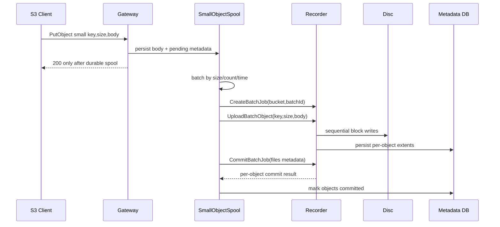

# BurnBridge Small Object Batching Design

## 背景

当前小文件写入路径按 S3 对象逐个执行：

1. Gateway 接收 `PutObject`。
2. Gateway 调用 Recorder `CreateJob`。
3. Gateway 通过 `UploadObject` gRPC 流写入一个对象。
4. Recorder 将对象数据写入光盘块设备，并记录 object segment/extents。
5. Gateway 调用 `CommitJob`，Record 侧落 UDF layout 数据。
6. 后续 `FinalizeLayout` 生成/刷新光盘 UDF 布局和元数据 DB。

这个模型对大文件和 multipart 已经比较合适，但对 2 KiB 级别小文件非常慢。原因不是网络传输本身，而是每个对象都会产生一次完整作业生命周期、一次流打开/关闭、一次 commit、一次 SQLite 元数据写入和一次 UDF layout 增量记录。光盘底层按 2048 字节块写入，单个小文件虽然可以对齐到块，但作业边界和元数据边界太密，导致光驱频繁等待、切换、刷新状态。

制作 ISO 后一次性刻录很快，是因为 ISO 工具先在内存/磁盘中完成文件树布局，再把连续数据和元数据作为大块顺序写入。BurnBridge 也可以借鉴这个思路，但必须保留 S3 对象语义、断电恢复、RS 恢复和增量追加能力。

## 目标

- 小文件高吞吐：大量小对象不再逐个触发 Recorder job/commit。
- S3 语义不变：对象 key、size、etag、head/get/list 行为保持独立。
- UDF 可见性正确：Finalize 后光盘根路径仍按对象相对路径展示，不暴露内部批文件。
- 块对齐正确：物理写入必须按 2048 字节块对齐，逻辑对象 size 保持原始大小。
- 恢复闭环：断电或进程退出后，已提交批次可恢复，未提交批次可重放或丢弃，不产生幻读。
- RS 兼容：如果 bucket 开启 RS，小文件批次也要参与同一套冗余条带/extent 记录。

## 不建议的方案

### Gateway 将多个小文件拼成一个普通对象

这种方式实现快，但不适合上线：

- UDF 层只能看到一个聚合对象，除非额外维护虚拟索引。
- Record 侧无法自然为每个原始对象生成独立 UDF 文件节点。
- GetObject 需要网关做聚合文件切片读取，RS 恢复和挂载兜底都会复杂化。
- 光盘上其他工具看到的是聚合文件，不是用户对象文件。

结论：不采用。

### 每个小文件仍独立 Commit，只加客户端并发

这只能减少客户端等待，不能减少光驱作业切换、gRPC 生命周期、SQLite commit 次数和 UDF layout 记录次数。对光盘机械行为帮助有限。

结论：收益不足。

## 推荐方案：Record 侧批量小对象写入

新增“小对象批次”写入能力。Gateway 仍按 S3 对象接收请求，但对小于阈值的对象先落到本地 spool，再由批处理器按阈值或时间窗口打包下发给 Recorder。Recorder 在一个批量 job 中连续写入多个逻辑对象，并为每个对象返回独立 extents。

### 逻辑流程



## API 设计

优先新增专用 RPC，而不是复用当前 `UploadObject`。

```protobuf
rpc CreateBatchJob(CreateBatchJobRequest) returns (CreateBatchJobResponse);
rpc UploadBatch(stream UploadBatchChunk) returns (stream UploadBatchAck);
rpc CommitBatchJob(CommitBatchJobRequest) returns (CommitBatchJobResponse);
rpc AbortBatchJob(AbortBatchJobRequest) returns (AbortBatchJobResponse);
```

核心字段：

- `batch_id`：Gateway 生成，幂等恢复使用。
- `bucket`：数据桶。
- `object_key`：每个逻辑对象的相对路径。
- `logical_size`：原始对象长度。
- `content_md5` 或 `etag`：对象完整性。
- `batch_offset`：对象在批次物理流中的偏移。
- `padding_bytes`：对象尾部为满足 2048 字节对齐补齐的字节数。
- `disc_extents`：Recorder 返回的每个对象物理 extent，不包含 padding 的逻辑 size。

## UDF 布局层次

UDF 布局应继续放在 Recorder 侧，不移动到 Gateway。

原因：

- Recorder 最接近 Primo SDK 和实际块设备，能拿到真实写入位置/extents。
- 现有 `UdfLayoutStore` 已负责 `(bucket, object_key) -> extents/logical size`。
- `FinalizeLayout` 已在 Recorder 侧构建 `DataFile` 树，适合继续统一处理普通对象、multipart 对象、小文件批对象。

批量写入后，每个小对象仍调用等价的 `PersistCommittedObject`，区别是这些对象共享一个 batch job 的连续物理写入过程。UDF tree builder 不需要知道它们来自批次，只需要看到独立的 object key、logical size 和 extents。

## 块对齐策略

推荐在 Recorder 写入层做对齐：

- Gateway spool 保存原始字节，不主动补零。
- Recorder 写入每个小对象时按 `logical_size` 计算尾部 padding。
- 物理写入包含 padding，UDF 文件长度只记录 `logical_size`。
- extents 记录物理块范围，额外记录 `logical_bytes`，读取时只返回逻辑长度。

这样可以避免 Gateway 和 Recorder 对 padding 规则不一致，也能让 RS/extent 记录与真实写盘保持一致。

## Gateway 侧缓存与状态

新增 `small_object_spool`：

- 只接管小于阈值的 `PutObject`，例如默认 `<= 1 MiB`，可配置。
- spool 文件落盘后才返回 S3 成功，避免客户端认为成功但进程崩溃丢失对象。
- Gateway metadata 增加对象状态：`spooled`、`batching`、`committed`、`failed`。
- `ListObjects/HeadObject/GetObject` 对 `spooled` 对象要可见，并从 spool 读取；`committed` 后从 Record/光盘读取。
- 介质弹出或切盘时，未 committed 的 spool 必须绑定 media id。新盘不能继续提交旧盘 spool，避免幻读。

## Flush 触发条件

建议配置：

- `SmallObjectBatchEnabled`: 默认 false，灰度打开。
- `SmallObjectMaxBytes`: 默认 1 MiB。
- `SmallObjectBatchTargetBytes`: 默认 64 MiB 或 128 MiB。
- `SmallObjectBatchMaxCount`: 默认 4096。
- `SmallObjectBatchMaxDelay`: 默认 2-5 秒。
- `SmallObjectBatchFlushOnFinalize`: true。

触发 flush 的时机：

- batch 达到目标字节数。
- batch 达到最大对象数。
- 最老对象等待超过最大延迟。
- 收到 `FinalizeLayout` 或 `CloseDisc`。
- 当前剩余空间不足以继续接受新小对象。

## 断电恢复

需要两级恢复：

### Gateway spool 恢复

- 启动时扫描 `spooled/batching` 状态。
- 如果 media id 与当前光盘一致，继续 flush。
- 如果 media id 不一致，保留为 orphan，不导入当前 bucket，等待人工处理或清理。

### Recorder batch 恢复

- `CreateBatchJob(batch_id)` 幂等。
- `UploadBatch` ack 每个对象或每个写入 segment。
- `CommitBatchJob` 幂等：如果对象 extents 已存在且 etag/size 一致，返回成功。
- 未 commit 完成的 batch 在启动恢复时标记 failed，并由 Gateway 根据 spool 重放。

## 读取闭环

读取顺序建议：

1. Gateway metadata 中对象为 `spooled/batching`：从 Gateway spool 读。
2. 对象为 `committed` 且 bucket 支持 RS：走 Recorder read，保证冗余恢复生效。
3. 对象为 `committed` 且无 RS：可走挂载点兜底。
4. 光盘无 metadata DB 的外部盘：仍走挂载点只读兜底。

这样不会破坏之前定义的 RS 读取优先级。

## 修改代价

### Gateway

代价：中高。

- 新增 spool 存储、状态表和恢复任务。
- PutObject 小文件路径改为异步批处理。
- List/Head/Get 需要同时合并 spool 与 committed 视图。
- Finalize/CloseDisc 前必须 drain spool。
- 需要容量预估包含 pending spool。

### Recorder

代价：高。

- 新增 batch RPC 和 batch job 生命周期。
- 写入层支持一个 job 内多个 logical file。
- layout store 支持批量事务写入多个对象。
- CommitBatchJob 需要一次提交多文件 metadata。
- 需要补齐 batch 级恢复、取消、日志降噪。

### 测试工具

代价：中。

- 新增 small-file 批量测试模式。
- 构造大量 2 KiB/4 KiB/16 KiB 文件。
- 校验 List/Head/Get/Finalize/CloseDisc/换盘/断电恢复。

## 分阶段上线计划

### Phase 1：只做同步批量 RPC，不异步返回

Gateway 收到小文件后暂存到内存/临时文件，达到批次后同步发送；对象在批次 commit 后才对客户端返回 200。

优点：语义简单，不会出现“客户端成功但还未写盘”的窗口。

缺点：客户端等待时间仍受 batch flush 影响，但比逐文件刻录快很多。

建议先做这一阶段，风险最低。

### Phase 2：持久 spool + 异步 flush

Gateway 落盘后即可返回 200，后台批量刻录。需要完整处理 pending 对象可见性、换盘、容量不足、断电恢复。

优点：客户端体验最好。

缺点：一致性复杂度明显上升。

### Phase 3：自适应策略

根据文件大小、当前队列、剩余容量、RS 配置自动选择：

- 大文件：PutObject/multipart 连续流。
- 小文件：batch。
- Finalize 前：强制 flush 所有 pending batch。

## 推荐结论

可以优化，而且值得优化；但不建议用“Gateway 拼一个大对象”的快捷方案。

建议实现为 Record 侧原生小文件批量写入能力：

- UDF 布局仍在 Record 侧。
- Gateway 负责小文件缓存、批次调度和 S3 视图合并。
- Record 负责连续写盘、块对齐、per-object extent 和批量 layout 落库。

最小可上线闭环是 Phase 1：同步批量 RPC。它能先验证光驱是否明显减少机械切换和 job 开销，同时不引入异步成功语义。Phase 1 验证稳定后，再做 Phase 2 的持久 spool 和后台 flush。
